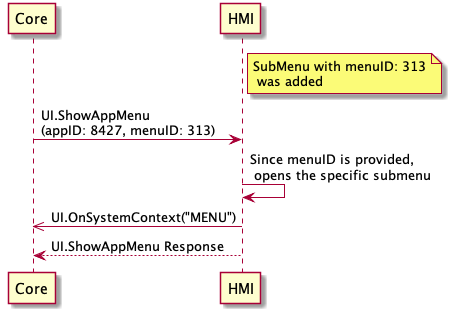

## ShowAppMenu

Type
: Function

Sender
: SDL

Purpose
: Show an app's menu or a corresponding sub-menu.

### Request

#### Parameters

|Name|Type|Mandatory|Additional|Description|
|:---|:---|:--------|:---------|:----------|
|menuID|Integer|false|minvalue: 1<br>maxvalue: 2000000000|If ommited the HMI opens the app's menu.<br>If set to a sub-menu ID the HMI opens the corresponding sub-menu previously added using `AddSubMenu`|
|appID|Integer|true| | |

### Response

#### Parameters

This RPC has no additional parameter requirements

### Sequence Diagrams
|||
ShowAppMenu request(without menuID)

|||
|||
ShowAppMenu request(with menuID)

|||

### Example Request

```json
{
  "id" : 120,
  "jsonrpc" : "2.0",
  "method" : "UI.ShowAppMenu",
  "params" :
  {
    "menuID" : 313,
    "appID" : 8726
  }
}
```
### Example Response

```json
{
  "id" : 120,
  "jsonrpc" : "2.0",
  "result" :
  {
    "code" : 0,
    "method" : "UI.ShowAppMenu"
  }
}
```
