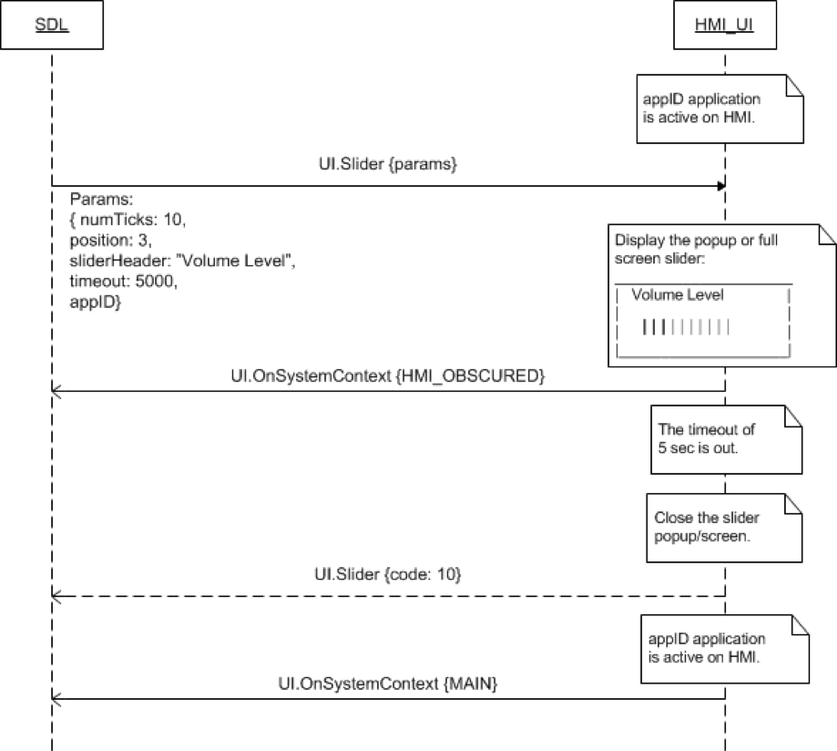
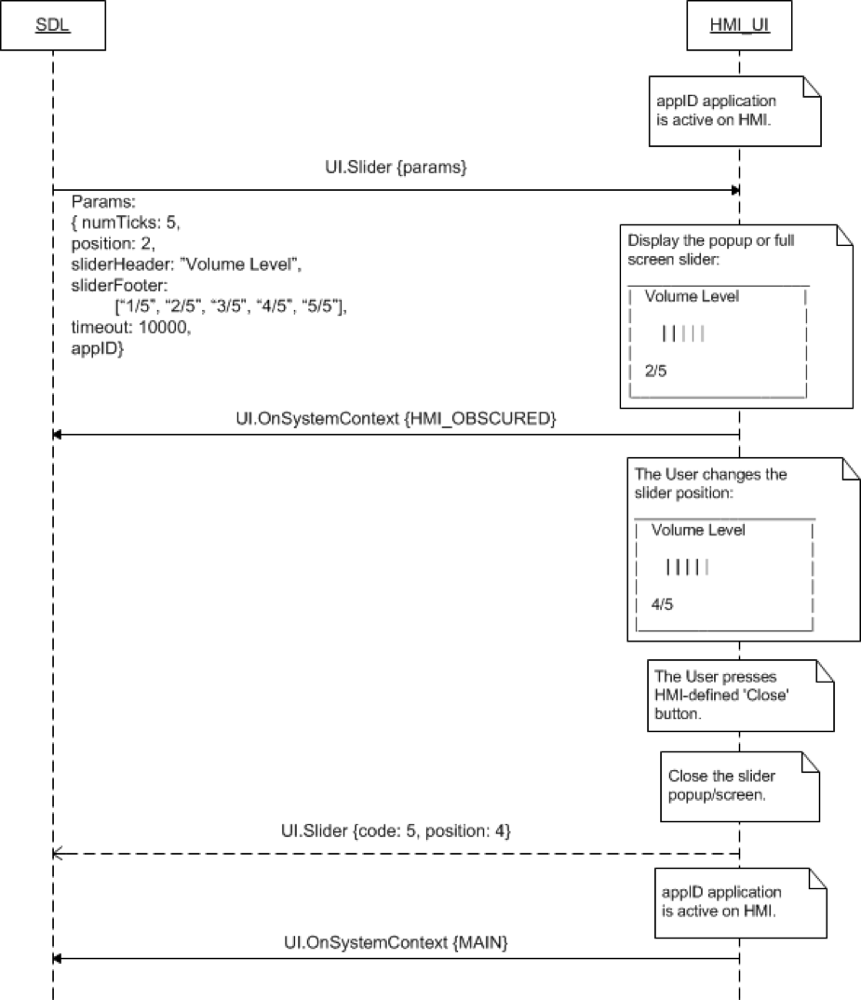
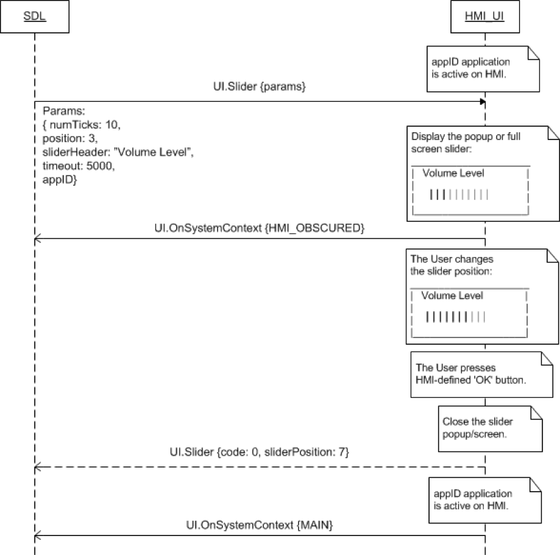

## Slider

Type
: Function

Sender
: SDL

Purpose
: Display a user controlled slider UI element.

### Request

#### Parameters

|Name|Type|Mandatory|Additional|
|:---|:---|:--------|:---------|
|numTicks|Integer|true|minvalue: 2<br>maxvalue: 26|
|position|Integer|true|minvalue: 1<br>maxvalue: 26|
|sliderHeader|String|true|maxlength: 500|
|sliderFooter|String|false|array: true<br>minsize: 1<br>maxsize: 26<br>maxlength: 500|
|timeout|Integer|true|minvalue: 1000<br>maxvalue: 65535|
|appID|Integer|true||
|cancelID|Integer|false||

### Response

#### Parameters

|Name|Type|Mandatory|Additional|
|:---|:---|:--------|:---------|
|sliderPosition|Integer|false|minvalue: 1<br>maxvalue: 26|

### Sequence Diagrams

|||
Slider with static footer displayed closed by timeout

|||

|||
Slider with dynamic footer aborted

|||

|||
Slider with OK Button press

|||

### JSON Message Examples

#### Example Request

```json
{
  "id" : 133,
  "jsonrpc" : "2.0",
  "method" : "UI.Slider",
  "params" :
  {
    "numTicks" : 5,
    "position" : 2,
    "sliderHeader" : "Volume Level",
    "sliderFooter" : [ "1/5", "2/5", "3/5", "4/5", "5/5" ],
    "timeout" : 10000,
    "appID" : 4328
  }
}
```

#### Example Response

```json
{
  "id" : 133,
  "jsonrpc" : "2.0",
  "result" :
  {
    "sliderPosition" : 4,
    "code" : 0,
    "method" : "UI.Slider"
  }
}
```

#### Example Response (Timeout)

```json
{
  "id" : 133,
  "jsonrpc" : "2.0",
  "result" :
  {
    "sliderPosition" : 5,
    "code" : 10,
    "method" : "UI.Slider"
  }
}
```

#### Example Error

```json
{
  "id" : 133,
  "jsonrpc" : "2.0",
  "error" :
  {
    "code" : 13,
    "message" : "One of the provided IDs is not valid",
    "data" :
    {
      "method" : "UI.Slider"
    }
  }
}
```
