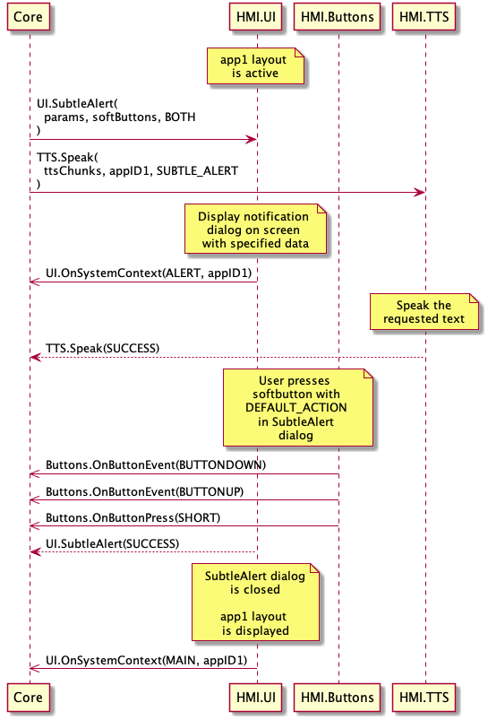
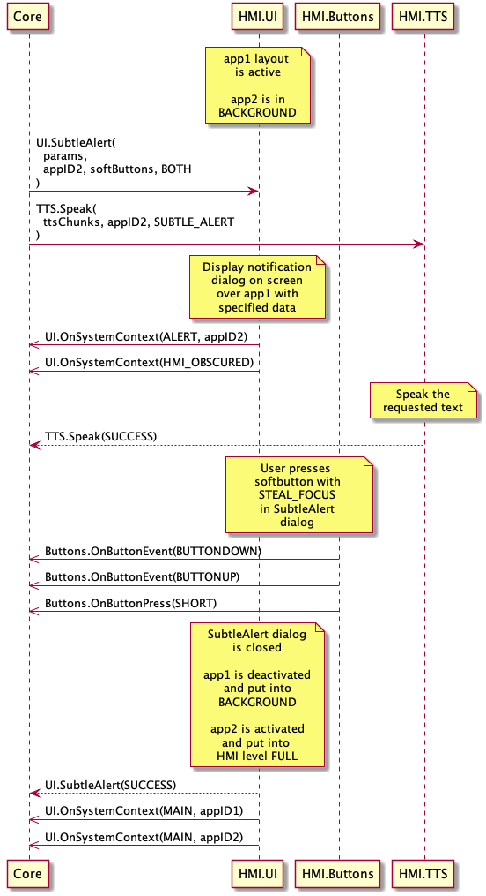
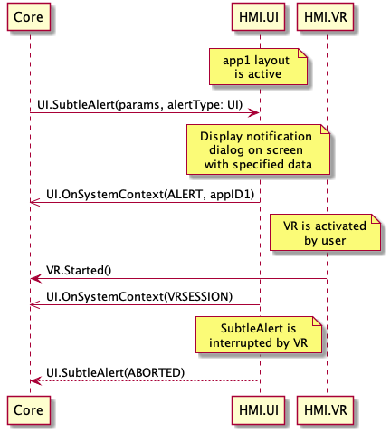
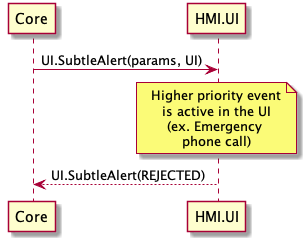
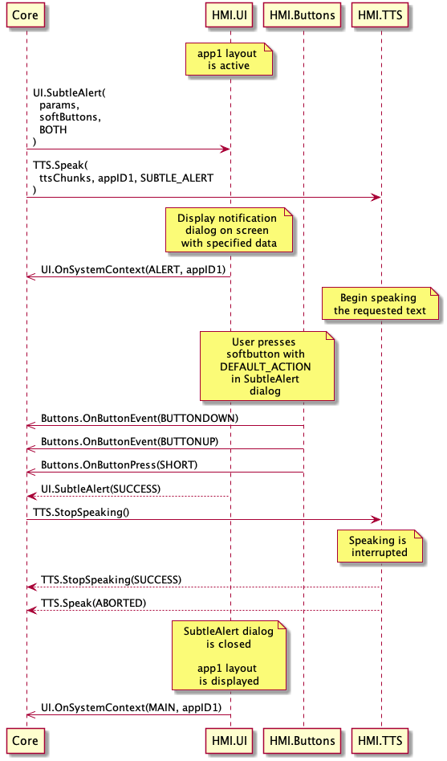

## SubtleAlert

Type
: Function

Sender
: SDL

Purpose
: Display a subtle notification-style alert message on the HMI

SDL sends the `UI.SubtleAlert` RPC when some information needs to be displayed to the user on a display in a non-intrusive way. The request includes an optional array of `softButtons` which the user can use to take action on the alert. The alert can also be selected directly to bring the associated application to the foreground.

!!! must

  1. If the alert includes a soft button of type `STEAL_FOCUS` and the user presses the button, the HMI must bring the app associated with the SubtleAlert into full screen mode.
  2. If the user selects the alert directly (without selecting one of the softbuttons), the HMI must send a [UI.OnSubtleAlertPressed](../onsubtlealertpressed) notification to SDL and activate the app that is associated with this SubtleAlert. The alert must then be dismissed from the HMI.
  3. The HMI must send [UI.OnSystemContext](../onsystemcontext) with type `ALERT` for the application which is in `FULL` mode.
  4. Respond to the SubtleAlert earlier than SDL's default timeout of 10 seconds - applicable only to alerts without `softButtons`.
  5. Display the notification dialog with the text information in the `alertStrings` array and optional `softButtons`.
  6. Send [Buttons.OnButtonPress](../../buttons/onbuttonpress) and/or [Buttons.OnButtonEvent](../../buttons/onbuttonevent) notifications if soft buttons associated with the notification are pressed by the user.
  7. Send `BC.OnResetTimeout` notification to SDL to reset the timeout in case HMI needs more time to process `UI.SubtleAlert` request.
  8. Dismiss the alert after the duration has passed since receipt of the request and send a `TIMED_OUT` response to SDL.

!!!

!!! may

The HMI may provide the user with a system defined "close" button providing the user with the possibility to dismiss the alert. In this case the HMI must still respond to the SubtleAlert request.

!!!

!!! note

An SubtleAlert message may be sent to the HMI for an application which is not currently active. If the alert contains `softButtons` then the duration parameter will be omitted. In this case the HMI is required to assign a timeout, and recommended to set a longer than usual timeout.

!!!

### Request

#### Parameters

|Name|Type|Mandatory|Additional|
|:---|:---|:--------|:---------|
|alertStrings|[Common.TextFieldStruct](../../common/structs/#textfieldstruct)|true|array: true<br>minsize: 0<br>maxsize: 2|
|alertIcon|[Common.Image](../../common/structs/#image)|false||
|duration|Integer|false|minvalue: 3000<br>maxvalue: 10000|
|softButtons|[Common.SoftButton](../../common/structs/#softbutton)|false|array: true<br>minsize: 0<br>maxsize: 2|
|alertType|[Common.AlertType](../../common/enums/#alerttype)|true||
|appID|Integer|true||
|cancelID|Integer|false||

### Response

#### Parameters

|Name|Type|Mandatory|Additional|
|:---|:---|:--------|:---------|
|tryAgainTime|Integer|false|minvalue: 0<br>maxvalue: 2000000000|

### Sequence Diagrams

|||
SubtleAlert closed by DEFAULT_ACTION

|||

|||
SubtleAlert closed by STEAL_FOCUS

|||

|||
SubtleAlert Aborted by <abbr title="Voice Recognition">VR</abbr> Session

|||

|||
SubtleAlert Rejected

|||

|||
SubtleAlert BOTH UI Closed before <abbr title="Text To Speech">TTS</abbr> finishes Speaking

|||

### JSON Message Examples

#### Example Request

```json
{
  "id" : 92,
  "jsonrpc" : "2.0",
  "method" : "UI.SubtleAlert",
  "params" : {
    "alertStrings" : [
      {
        "fieldName" : "subtleAlertText1",
        "fieldText" : "WARNING"
      },
      {
        "fieldName" : "subtleAlertText2",
        "fieldText" : "Hard weather conditions"
      }
    ],
    "softButtons" : [
      {
        "type" : "TEXT",
        "text" : "OK",
        "softButtonID" : 697,
        "systemAction" : "DEFAULT_ACTION"
      }
    ],
    "alertType" : "BOTH",
    "appID" : 65539,
    "cancelID" : 32123
  }
}
```

#### Example Response

```json
{
  "id" : 92,
  "jsonrpc" : "2.0",
  "result" : {
    "code" : 0,
    "method" : "UI.SubtleAlert"
  }
}
```

#### Example Error

```json
{
  "id" : 92,
  "jsonrpc" : "2.0",
  "error" : {
    "code" : 4,
    "message" : "The requested command was rejected.",
    "data" : {
      "tryAgainTime" : 10000,
      "method" : "UI.SubtleAlert"
    }
  }
}
```
