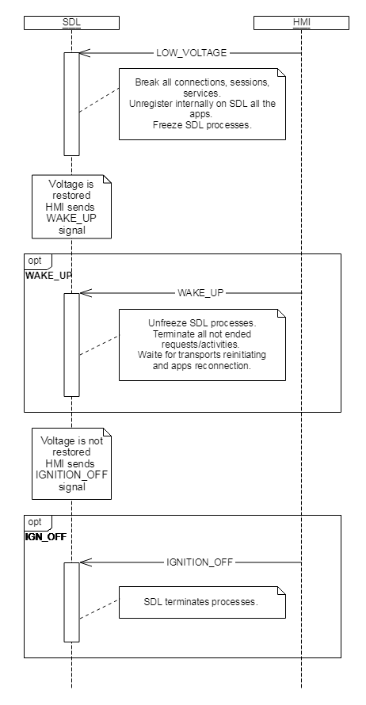

## Low Voltage  

Type
: Signal

Sender
: HMI

Purpose
: To suspend/restore SDL's services due to a low voltage event

### Description  
A 'LowVoltage' event occurs on HMI when battery voltage hits below a certain predefined threshold set by the system.  
In case of such event, SDL operations are halted including receiving and processing of normal RPC messages from HMI. 
HMI sends system signals of the range SIGRTMIN - SIGRTMAX for LowVoltage, WakeUp and IgnitionOff to SDL. 
After the voltage level is restored HMI sends `WAKE_UP` signal to SDL and SDL processes all operations resumption.

!!!
MUST  
1. Send `LOW_VOLTAGE` signal to SDL when a 'LowVoltage' event occurs
2. Send `WAKE_UP` signal to SDL when the voltage recovers
3. Send `IGNITION_OFF` signal when SDL processes have to be terminated, applications have to be unregistered due SDL functionality suspension during a LOW VOLTAGE event
!!!

#### SDL behavior in case of a `LOW_VOLTAGE` event:
* SDL ignores all the requests from mobile applications without providing any kind of response.
* SDL ignores all responses and messages from HMI except for `WAKE_UP` or `IGNITION_OFF` signals.
* SDL stops audio/video streaming services.
* All transports are unavailable for SDL.
* SDL persists resumption related data stored before receiving a `LOW_VOLTAGE` signal.
* SDL and the PoliciesManager must persist 'consumer data' (resumption-related + local PT) periodically and independently of the external events. 

#### SDL resumes its regular work after receiving a "WAKE_UP" signal:
* After receiving a `WAKE_UP` signal, all applications will be unregistered and the device disconnected.
* If `LOW_VOLTAGE` was received at the moment of writing to policies database, SDL and Policies Manager must keep policies database correct and working. After `WAKE_UP` policy database reflects the last known correct state.
* SDL must be able to start up correctly in the next ignition cycle after it was powered off in low voltage state.   


#### Details of implementation

UNIX signals are used to exchange shutdown and wake-up signals between HMI and SDL Core during a 'LowVoltage' event.

UNIX signals provide ability to use signals from SIGRTMIN to SIGRTMAX for custom needs.  
SDL uses this range for handling `LOW_VOLTAGE`, `WAKE_UP`, `IGNITION_OFF` notifications. 

Offset for SIGRTMIN from this notifications is defined in the 'Main' section of the smartDeviceLink.ini file: 

```
[MAIN] 
LowVoltageSignal = 1 ; Offset for from SIGRTMIN
WakeUpSignal = 2 ; Offset for from SIGRTMIN
IgnitionOffSignal = 2 ; Offset for from SIGRTMIN
```

### Sequence Diagrams  

|||
Low Voltage  
  
|||