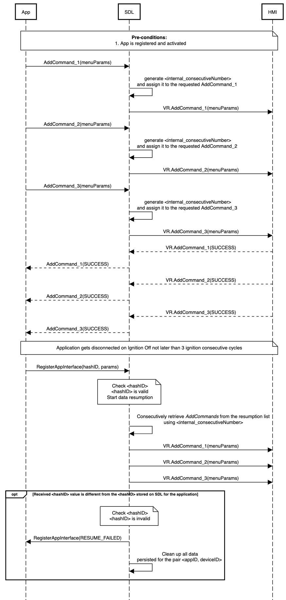

## AddCommand

Type
: Function

Sender
: SDL

Purpose
: Add a command for voice recognition

### Request

If the application sends `AddCommand` with the `vrCommands` parameter then SDL Core will maintain a list of the added `vrCommands`.  
For each AddCommand, only the first item in the `vrCommands` array shall be added to the list.

Whenever the internal list of added `vrCommands` is updated SDL Core must:  
* Construct the `vrHelp` and `helpPrompt`  parameters using the data from the list SDL created internally.  
* Send these parameters to the HMI via the `SetGlobalProperties` RPC.

If the application sends a `CreateInteractionChoiceSet` RPC request that contains `vrCommand` parameters, SDL Core will send the HMI a `VR.AddCommand` request for each `Choice`.

!!! note
The parameter `type` included in the `VR.AddCommand` request is the differentiator the HMI should use to know if the VR Command originated from an `AddCommand` RPC or a `CreateInteractionChoiceSet` RPC.

`Choice` type <abbr title="Voice Recognition">VR</abbr> Commands should only be used during a `PerformInteraction` RPC Request.

`Command` type <abbr title="Voice Recognition">VR</abbr> Commands should only be used when the user wants to interact with the App's Menu.

During data resumption SDL sends VR.AddCommands to HMI by `internal_consecutiveNumber` in the same order as they were created by mobile app in previous ignition cycle.

!!! must

Renew the timeout informing SDL about this event via `BC.OnResetTimeout` notification in case it requires more time for processing `VR.AddCommand` request (due to a batch of `vrCommands`).

!!!

#### Parameters

|Name|Type|Mandatory|Additional|
|:---|:---|:--------|:---------|
|cmdID|Integer|true|minvalue: 0<br>maxvalue: 2000000000|
|vrCommands|String|true|array: true<br>minsize: 1<br>maxsize: 100<br>maxlength: 99|
|type|[Common.VRCommandType](../../common/enums/#vrcommandtype)|true||
|grammarID|Integer|true|minvalue: 0<br>maxvalue: 2000000000|
|appID|Integer|false||

### Response

#### Parameters

This RPC has no additional parameter requirements

### Sequence Diagrams

|||
AddCommand

|||

|||
UI.AddCommand returns SUCCESS, VR.AddCommand fails

|||

|||
UI.AddCommand returns SUCCESS, VR.AddCommand no response

|||

|||
UI.AddCommand fails, VR.AddCommand returns SUCCESS

|||

|||
UI.AddCommand no response, VR.AddCommand returns SUCCESS

|||

|||
AddCommand restoring during data resumption

|||

### JSON Message Examples

#### Example Request

```json
{
  "id" : 119,
  "jsonrpc" : "2.0",
  "method" : "VR.AddCommand",
  "params" :
  {
    "cmdID" : 4365,
    "vrCommands" :
    [
         "Leave",
         "Exit",
         "Quit"
    ],
    "grammarID" : 123,
    "type" : "Command",
    "appID" : 64467
  }
}
```

#### Example Response

```json
{
  "id" : 119,
  "jsonrpc" : "2.0",
  "result" :
  {
    "code" : 0,
    "method" : "VR.AddCommand"
  }
}
```

#### Example Error

```json
{
  "id" : 119,
  "jsonrpc" : "2.0",
  "error" :
  {
    "code" : 13,
    "message" : "Provided appID is not valid",
    "data" :
    {
      "method" : "VR.AddCommand"
    }
  }
}
```
