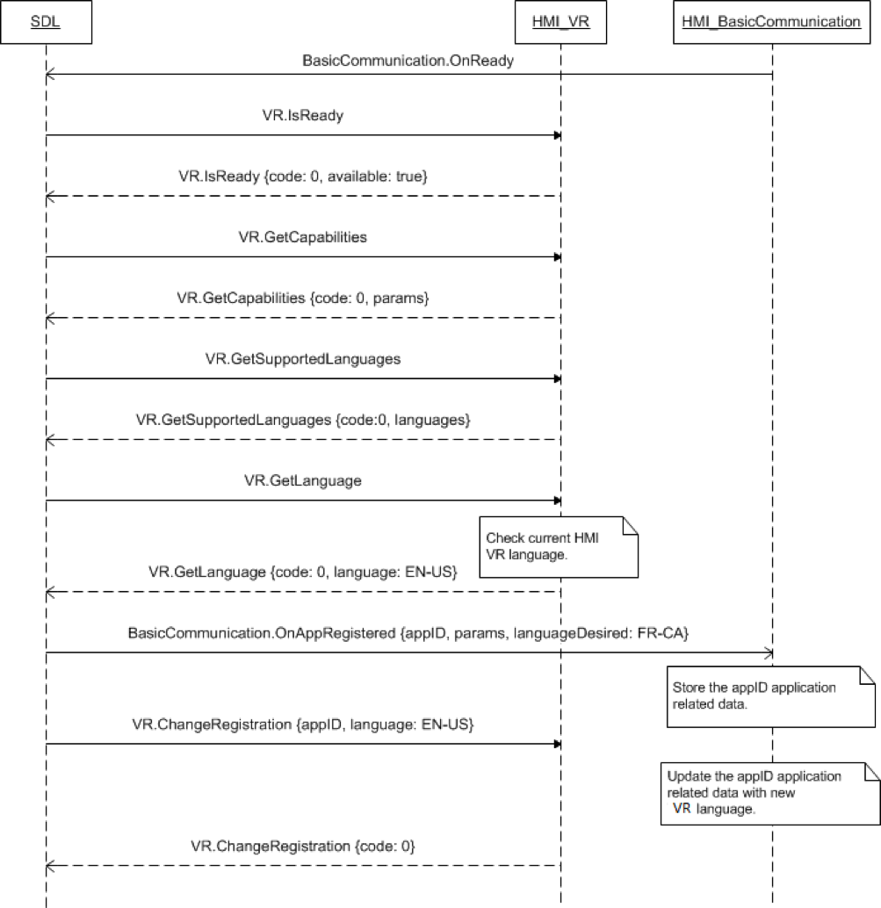

## ChangeRegistration

Type
: Function

Sender
: SDL

Purpose
: Change the language for voice recognition.

### Request

#### Parameters

|Name|Type|Mandatory|Additional|Description|
|:---|:---|:--------|:---------|:---------|
|vrSynonyms|String|false|array: true<br>minsize: 1<br>maxsize: 100<br>maxlength: 40|Request new VR synonyms registration<br>Defines an additional voice recognition command.<br>Must not interfere with any name of previously registered applications from the same device.|
|language|[Common.Language](../../common/enums/#language)|true||The language application wants to switch to.|
|appID|Integer|true||ID of application that concerns this RPC.|

### Response

#### Parameters

This RPC has no additional parameter requirements

### Sequence Diagrams
|||
ChangeRegistration

|||

### JSON Example Request

```json
{
  "id" : 206,
  "jsonrpc" : "2.0",
  "method" : "VR.ChangeRegistration",
  "params" :
  {
    "language" : "DE-DE",
    "appID" : 13264
  }
}
```

### JSON Example Response

```json
{
  "id" : 206,
  "jsonrpc" : "2.0",
  "result" :
  {
    "code" : 0,
    "method" : "VR.ChangeRegistration"
  }
}
```

### JSON Example Error

```json
{
  "id" : 206,
  "jsonrpc" : "2.0",
  "error" :
  {
    "code" : 22,
    "message" : "The unknown error occurred",
    "data" :
    {
      "method" : "VR.ChangeRegistration"
    }
  }
}
```
