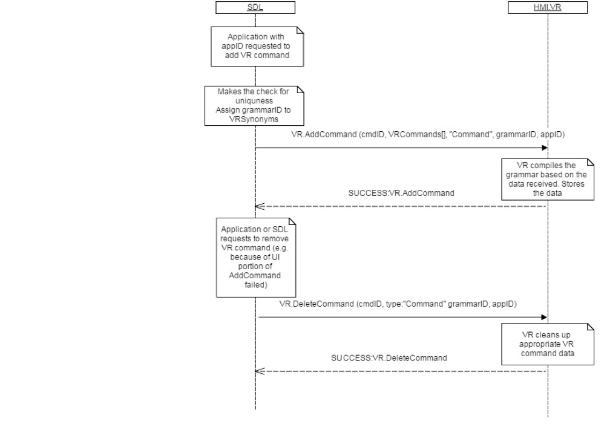

## DeleteCommand

Type
: Function

Sender
: SDL

Purpose
: Remove a voice recognition command from the application's context.

### Request

#### Parameters

|Name|Type|Mandatory|Additional|
|:---|:---|:--------|:---------|
|cmdID|Integer|true|minvalue: 0<br>maxvalue: 2000000000|
|type|[Common.VRCommandType](../../common/enums/#vrcommandtype)|true||
|grammarID|Integer|true|minvalue: 0<br>maxvalue: 2000000000|
|appID|Integer|true||

### Response

#### Parameters

This RPC has no additional parameter requirements

### Sequence Diagrams
|||
DeleteCommand

|||

### JSON Message Examples

#### Example Request

```json
{
  "id" : 147,
  "jsonrpc" : "2.0",
  "method" : "VR. DeleteCommand",
  "params" :
  {
    "cmdID" : 4365,
      "type":"Command",
      "grammarID":13,
    "appID" : 8764
  }
}
```

#### Example Response

```json
{
  "id" : 147,
  "jsonrpc" : "2.0",
  "result" :
  {
    "code" : 0,
    "method" : "VR.DeleteCommand"
  }
}
```

#### Example Error

```json
{
  "id" : 147,
  "jsonrpc" : "2.0",
  "error" :
  {
    "code" : 13,
    "message" : "One of the provided IDs is not valid",
    "data" :
    {
      "method" : "VR.DeleteCommand"
    }
  }
}
```
