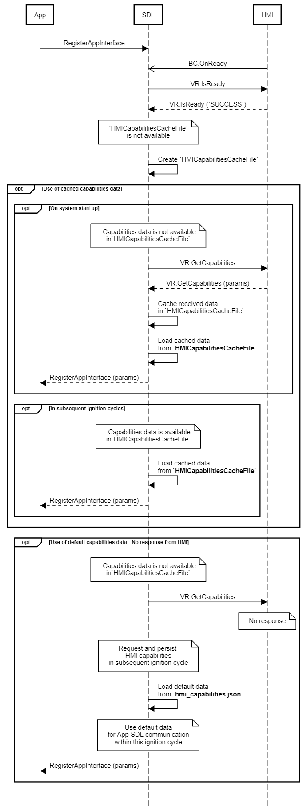

## GetCapabilities


### Request

#### Parameters

|Name|Type|Mandatory|Additional|Description|
|:---|:---|:--------|:---------|:----------|

### Response

#### Parameters

|Name|Type|Mandatory|Additional|Description|
|:---|:---|:--------|:---------|:----------|
|vrCapabilities|Common.VrCapabilities|false|array: true<br>minsize: 1<br>maxsize: 100||

#### VrCapabilities

|Name|Value|
|:---|:----|
|TEXT|0|

### Sequence Diagrams
|||
GetCapabilities

|||

### Example Request

```json

```
### Example Response

```json

```

### Example Error

```json

```
