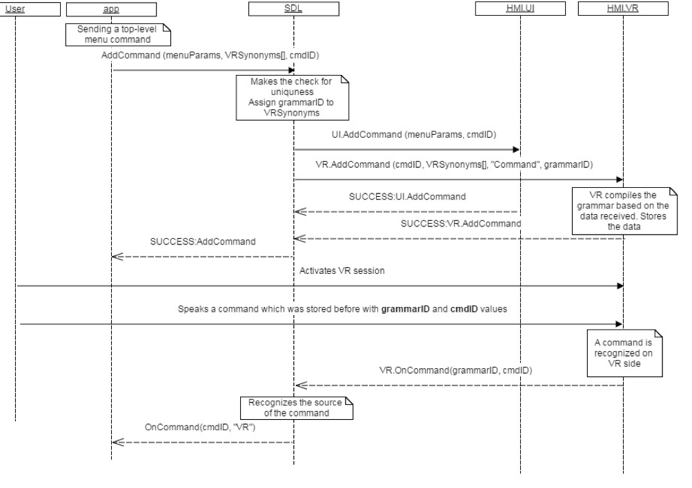

## OnCommand

Type
: Notification

Sender
: HMI

Purpose
: Inform SDL that an application's <abbr title="Voice Recognition">VR</abbr> command was recognized.

### Notification

#### Parameters

|Name|Type|Mandatory|Additional|
|:---|:---|:--------|:---------|
|cmdID|Integer|true|minvalue: 0<br>maxvalue: 2000000000|
|appID|Integer|true||

### Sequence Diagrams

|||
OnCommand

|||

### JSON Message Examples

#### Example Notification

```json
{
  "jsonrpc" : "2.0",
  "method" : "VR.OnCommand",
  "params" :
  {
    "cmdID" : 4365,
    "appID" : 12564
  }
}
```
