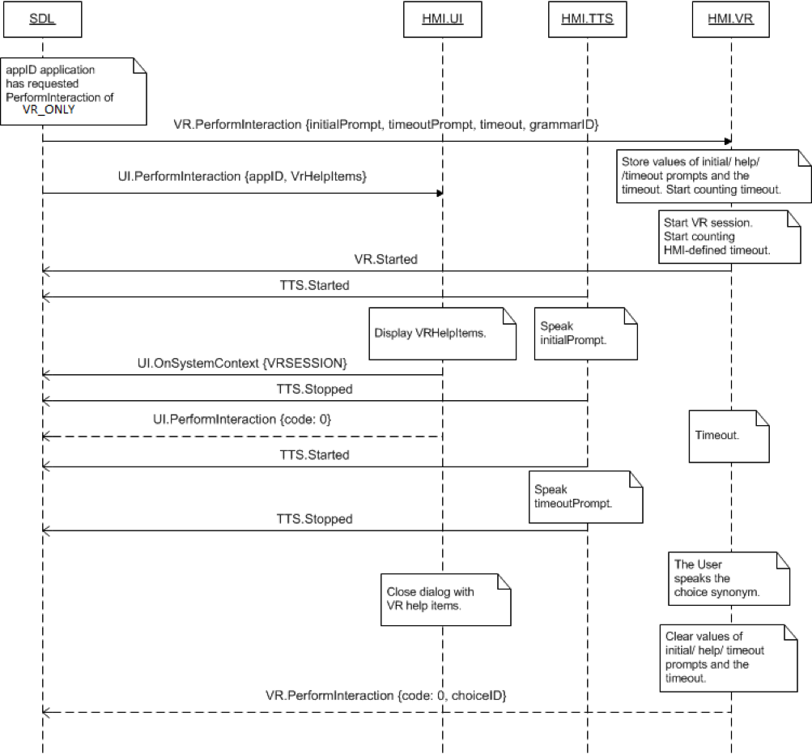
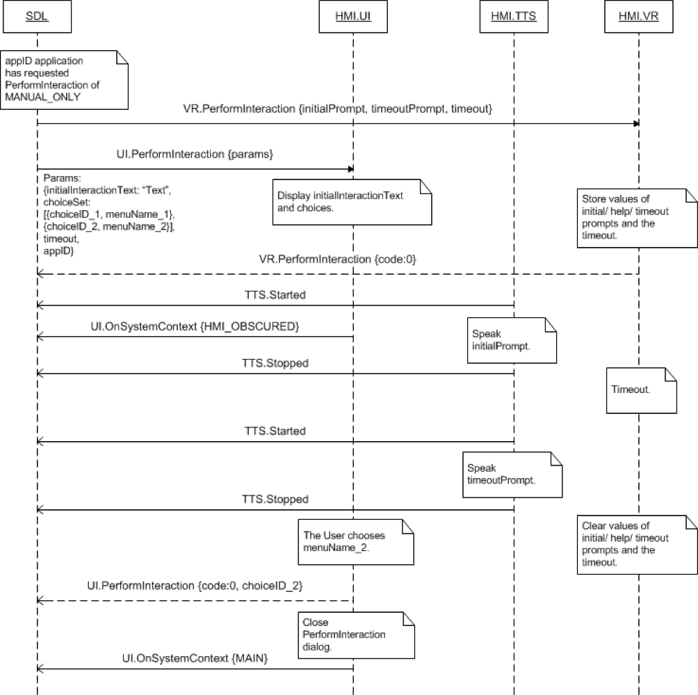
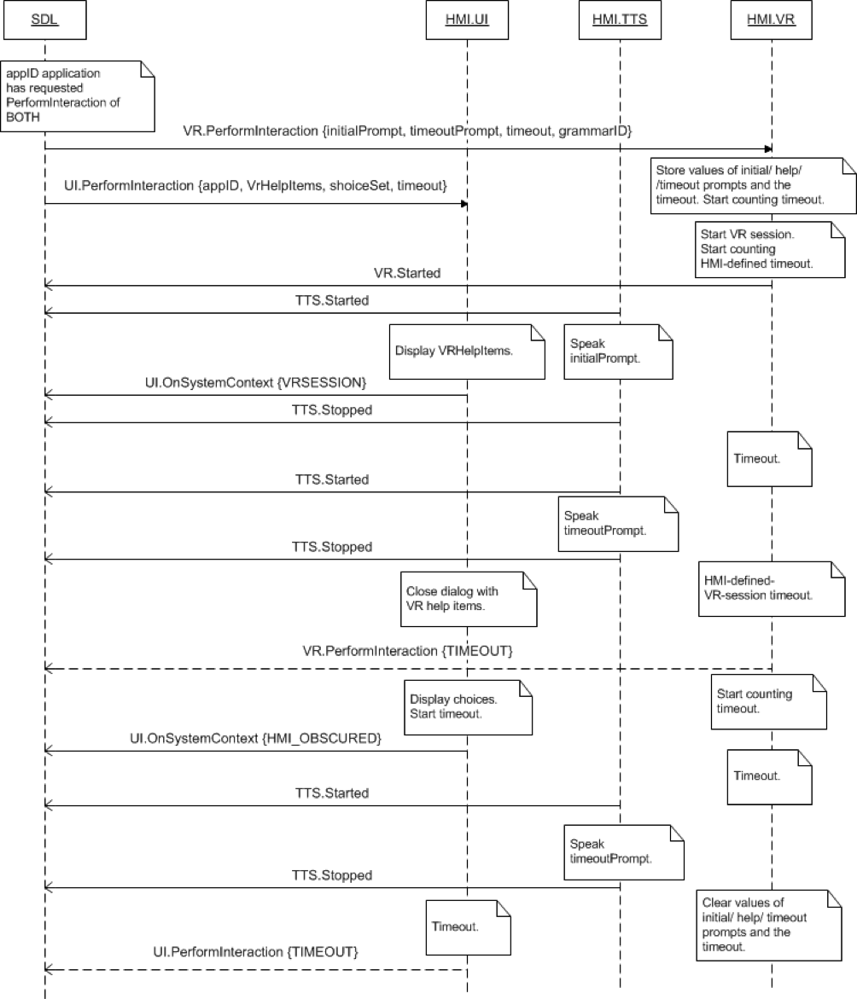

## PerformInteraction

Type
: Function

Sender
: SDL

Purpose
: Perform a VR interaction with the User.

### Request

#### Parameters

|Name|Type|Mandatory|Additional|
|:---|:---|:--------|:---------|
|helpPrompt|[Common.TTSChunk](../../common/structs/#ttschunk)|false|array: true<br>minsize: 1<br>maxsize: 100|
|initialPrompt|[Common.TTSChunk](../../common/structs/#ttschunk)|false|array: true<br>minsize: 1<br>maxsize: 100|
|timeoutPrompt|[Common.TTSChunk](../../common/structs/#ttschunk)|false|array: true<br>minsize: 1<br>maxsize: 100|
|timeout|Integer|true||
|grammarID|Integer|false|array: true<br>minsize: 1<br>maxsize: 100<br>minvalue: 0<br>maxvalue: 2000000000|
|appID|Integer|true||
|cancelID|Integer|false||

### Response

#### Parameters

|Name|Type|Mandatory|Additional|
|:---|:---|:--------|:---------|
|choiceID|Integer|false|minvalue: 0<br>maxvalue: 2000000000|

### Sequence Diagrams
|||
PerformInteraction in VR Mode completed successfully

|||
|||
PerformInteraction in Manual Only Mode completed successfully

|||
|||
PerformInteraction in Both Mode times out

|||

### JSON Message Examples

#### Example Request

```json
{
  "id" : 79,
  "jsonrpc" : "2.0",
  "method" : "VR.PerformInteraction",
  "params" :
  {
    "initialPrompt" :
    [
      {
        "text" : "Please make your choice by voice", 
        "type" : "TEXT"
      }
    ],

    "helpPrompt" :
    [
      {
        "text" : "Yes", 
        "type" : "TEXT"
      },
      {
        "text" : "No", 
        "type" : "TEXT"
      },
      {
        "text" : "Skip", 
        "type" : "TEXT"
      }
    ],

    "timeoutPrompt" :
    [
      {
        "text" : "The time is about to run out", 
        "type" : "TEXT"
      }
    ],

    "timeout" : 10000,
    "grammarID" : 245,
    "appID" : 101
  }
}
```

#### Example Response

```json
{
  "id" : 79,
  "jsonrpc" : "2.0",
  "result" :
  {
    "choiceID" : 2416,
    "code" : 0,
    "method" : "VR.PerformInteraction"
  }
}
```

#### Example Error

```json
{
  "id" : 79,
  "jsonrpc" : "2.0",
  "error" :
  {
    "code" : 10,
    "message" : "Interaction reached the maximum timeout and will be closed",
    "data" :
    {
      "method" : "VR.PerformInteraction"
    }
  }
}
```
