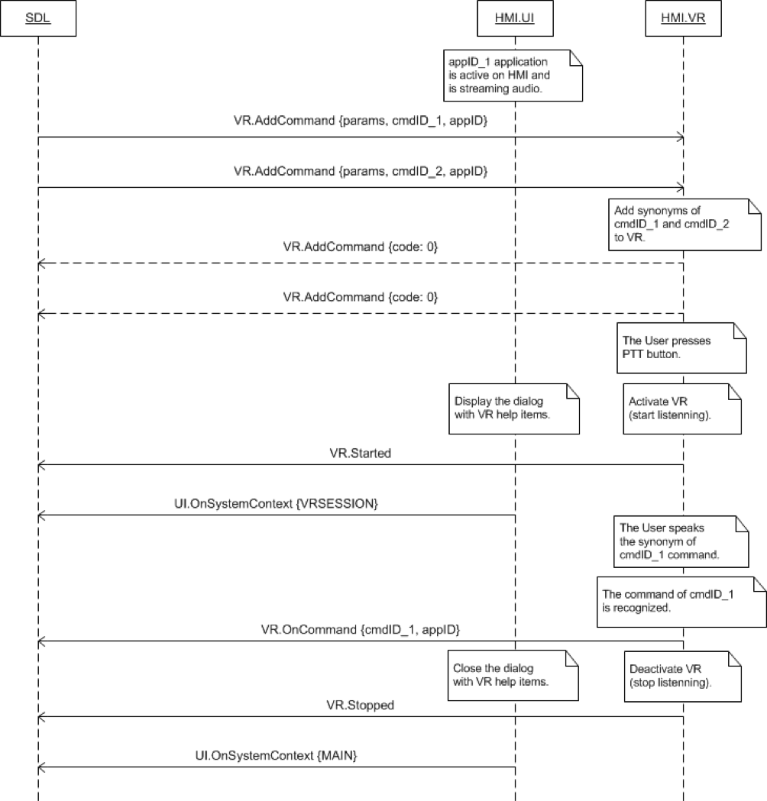

## Started

Type
: Notification

Sender
: HMI

Purpose
: Inform SDL about the start of a VR session

### Notification

#### Parameters

This RPC has no additional parameter requirements

### JSON Example Notification

```json
{
  "jsonrpc" : "2.0",
  "method" : "VR.Started"
}
```

### Sequence Diagrams
|||
Started on PTT Button Press

|||