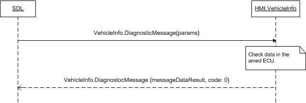

## DiagnosticMessage

Type
: Function

Sender
: SDL

Purpose
: Request current diagnostic messages.

### Request

#### Parameters

|Name|Type|Mandatory|Additional|
|:---|:---|:--------|:---------|
|targetID|Integer|true|minvalue: 0<br>maxvalue: 65535|
|messageLength|Integer|true|minvalue: 0<br>maxvalue: 65535|
|messageData|Integer|true|array: true<br>minsize: 1<br>maxsize: 65535<br>minvalue: 0<br>maxvalue: 255|
|appID|Integer|true||

### Response

#### Parameters

|Name|Type|Mandatory|Additional|
|:---|:---|:--------|:---------|
|messageDataResult|Integer|true|array: true<br>minsize: 1<br>maxsize: 65535<br>minvalue: 0<br>maxvalue: 255|

### Sequence Diagrams

|||
DiagnosticMessage

|||

### JSON Message Examples

#### Example Request

```json
{
  "id" : 139,
  "jsonrpc" : "2.0",
  "method" : "VehicleInfo.DiagnosticMessage",
  "params" :
  {
    "targetID" : 5456,
    "messageLength" : 1084,
    "messageData" : [1,2,3,4,5,6,7,8,9],
    "appID" : 65368
  }
}
```

#### Example Response

```json
{
  "id" : 139,
  "jsonrpc" : "2.0",
  "result" :
  {
    "messageDataResult" : [1,2,3,4,5,6],
    "code" : 0,
    "method" : "VehicleInfo.DiagnosticMessage"
  }
}
```

#### Example Error

```json
{
  "id" : 139,
  "jsonrpc" : "2.0",
  "error" :
  {
    "code" : 9,
    "message" : "Data not available",
    "data" :
    {
      "method" : "VehicleInfo.DiagnosticMessage"
    }
  }
}
```
