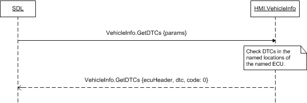

## GetDTCs

Type
: Function

Sender
: SDL

Purpose
: Request DTCs from vehicle.

### Request

#### Parameters

|Name|Type|Mandatory|Additional|
|:---|:---|:--------|:---------|
|ecuName|Integer|true|minvalue: 0<br>maxvalue: 65535|
|dtcMask|Integer|false|minvalue: 0<br>maxvalue: 255|
|appID|Integer|true||

### Response

#### Parameters

|Name|Type|Mandatory|Additional|
|:---|:---|:--------|:---------|
|ecuHeader|Integer|true|minvalue: 0<br>maxvalue: 65535|
|dtc|String|false|array: true<br>minsize: 1<br>maxsize: 15<br>maxlength: 10|

### JSON Example Request

```json
{
  "id" : 139,
  "jsonrpc" : "2.0",
  "method" : "VehicleInfo.GetDTCs",
  "params" :
  {
    "ecuName" : 56,
    "dtcMask" : 84,
    "appID" : 65645
  }
}
```

### JSON Example Response

```json
{
  "id" : 139,
  "jsonrpc" : "2.0",
  "result" :
  {
    "ecuHeader" : 6534,
    "dtc" : ["84752093", "28237", "748398"],
    "code" : 0,
    "method" : "VehicleInfo.GetDTCs"
  }
}
```

### JSON Example Error

```json
{
  "id" : 139,
  "jsonrpc" : "2.0",
  "error" :
  {
    "code" : 9,
    "message" : "Data not available",
    "data" :
    {
      "method" : "VehicleInfo.GetDTCs"
    }
  }
}
```

### Sequence Diagrams
|||
GetDTCs

|||