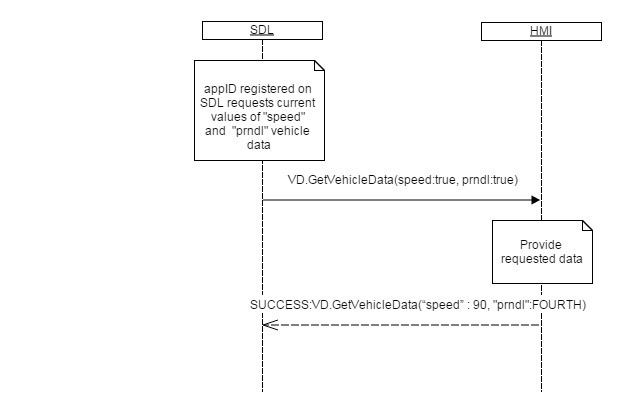
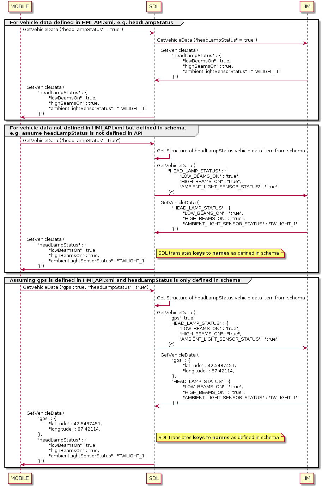
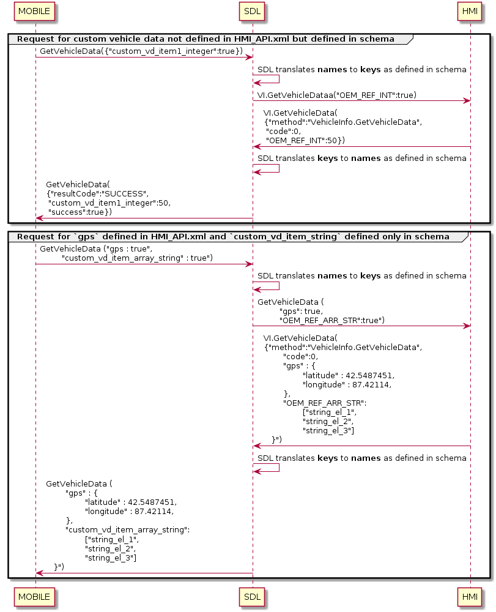

## GetVehicleData

Type
: Function

Sender
: SDL

Purpose
: Get current values of specified vehicle data types.

!!! must
1. Map each parameter in GetVehicleData request to its `<name>` in the case that it is listed in HMI_API.xml; `<name>` is always a single boolean value (according to API).  
2. Map each parameter in GetVehicleData request to its `<key>` in the case that it is not listed in HMI_API.xml; `<key>` in GetVehicleData request may be either a boolean or struct value. If the value is a struct, it may contain either boolean or nested struct values, structured according to the vehicle data structure defined in `schema_items`. 
3. Respond with any custom vehicle data defined in `schema_items` included in the original request. 
    * Keys and names should not match at different levels of nesting.   
    * Schema_items should not have duplicate `name` and `key` for different vehicle data items/sub-params, except same items is defined for different versions.  
    * Schema_items should not have `name`/`key` equivalent to any RPC vehicle data item/sub-param.

4. Respond with any vehicle data defined in `HMI_API.xml` included in the original request.

!!!


!!! note

#### CloudAppVehicleID

* An optional parameter used by cloud apps or the policy server to identify the head unit
* Could be used by a cloud app to identify an incoming connection from core
* Could be used by a policy server to index cloud app configurations for a specific head unit

The HMI will have to update this field if the user chooses to reset this value (in case the vehicle changes owners)

!!!

!!! note

#### Roof `status` selection
* Convertible roof - `location` grid would span entire rows and columns and roof `status` could be `CLOSED` or `AJAR` with corresponding `state`. 
* Sunroof/Moonroof - `location` grid would span just actual location of sunroof/moonroof. `status` could be `CLOSED` or `AJAR` with corresponding `state`.
* Entire roof - `location` grid would span entire rows and columns and roof status would be `REMOVED` or `CLOSED/LOCKED`. `state` can be omitted.
* Other type of roof - `location` grid would span actual location of the roof as per physical location. `status` and `state` would be as per table below:

| Roof condition  | `status` | `state` |
| ------------- | ------------- | ------------- |
| Roof is closed and locked  | LOCKED  | `approximatePosition` = 0 & `deviation` = 0 |
| Roof is closed and unlocked  | CLOSED  | `approximatePosition` = 0 & `deviation` = 0 |
| Roof is closed and unknown locked state | CLOSED  | `approximatePosition` = 0 & `deviation` = 0 |
| Roof is open  | AJAR  | actual values of `approximatePosition` & `deviation` |
| Roof is physically removed  | REMOVED  | can be omitted OR `approximatePosition` = 0 & `deviation` = 0 |

!!!

### Request

#### Parameters

|Name|Type|Mandatory|Additional|
|:---|:---|:--------|:---------|
|gps|Boolean|false||
|speed|Boolean|false||
|rpm|Boolean|false||
|fuelLevel|Boolean|false||
|fuelLevel_State|Boolean|false||
|instantFuelConsumption|Boolean|false||
|externalTemperature|Boolean|false||
|vin|Boolean|false||
|prndl|Boolean|false||
|tirePressure|Boolean|false||
|odometer|Boolean|false||
|beltStatus|Boolean|false||
|bodyInformation|Boolean|false||
|deviceStatus|Boolean|false||
|driverBraking|Boolean|false||
|wiperStatus|Boolean|false||
|headLampStatus|Boolean|false||
|engineTorque|Boolean|false||
|accPedalPosition|Boolean|false||
|steeringWheelAngle|Boolean|false||
|eCallInfo|Boolean|false||
|airbagStatus|Boolean|false||
|emergencyEvent|Boolean|false||
|clusterModeStatus|Boolean|false||
|myKey|Boolean|false||
|turnSignal|Boolean|false||
|fuelRange|Boolean|false||
|engineOilLife|Boolean|false||
|electronicParkBrakeStatus|Boolean|false||
|cloudAppVehicleID|Boolean|false||
|gearStatus|Boolean|false||
|stabilityControlsStatus|Boolean|false||
|windowStatus|Boolean|false||
|handsOffSteering|Boolean|false||

### Response

#### Parameters

|Name|Type|Mandatory|Additional|
|:---|:---|:--------|:---------|
|gps|[Common.GPSData](../../common/structs/#gpsdata)|false||
|speed|Float|false|minvalue: 0<br>maxvalue: 700|
|rpm|Integer|false|minvalue: 0<br>maxvalue: 20000|
|fuelLevel|Float|false|minvalue: -6<br>maxvalue: 106|
|fuelLevel_State|[Common.ComponentVolumeStatus](../../common/enums/#componentvolumestatus)|false||
|instantFuelConsumption|Float|false|minvalue: 0<br>maxvalue: 25575|
|externalTemperature|Float|false|minvalue: -40<br>maxvalue: 100|
|vin|String|false|maxlength: 17|
|prndl|[Common.PRNDL](../../common/enums/#prndl)|false||
|tirePressure|[Common.TireStatus](../../common/structs/#tirestatus)|false||
|odometer|Integer|false|minvalue: 0<br>maxvalue: 17000000|
|beltStatus|[Common.BeltStatus](../../common/structs/#beltstatus)|false||
|bodyInformation|[Common.BodyInformation](../../common/structs/#bodyinformation)|false||
|deviceStatus|[Common.DeviceStatus](../../common/structs/#devicestatus)|false||
|driverBraking|[Common.VehicleDataEventStatus](../../common/enums/#vehicledataeventstatus)|false||
|wiperStatus|[Common.WiperStatus](../../common/enums/#wiperstatus)|false||
|headLampStatus|[Common.HeadLampStatus](../../common/structs/#headlampstatus)|false||
|engineTorque|Float|false|minvalue: -1000<br>maxvalue: 2000|
|accPedalPosition|Float|false|minvalue: 0<br>maxvalue: 100|
|steeringWheelAngle|Float|false|minvalue: -2000<br>maxvalue: 2000|
|eCallInfo|[Common.ECallInfo](../../common/structs/#ecallinfo)|false||
|airbagStatus|[Common.AirbagStatus](../../common/structs/#airbagstatus)|false||
|emergencyEvent|[Common.EmergencyEvent](../../common/structs/#emergencyevent)|false||
|clusterModeStatus|[Common.ClusterModeStatus](../../common/structs/#clustermodestatus)|false||
|myKey|[Common.MyKey](../../common/structs/#mykey)|false||  
|turnSignal|[Common.TurnSignal](../../common/enums/#turnsignal)|false||
|fuelRange|[Common.FuelRange](../../common/structs/#fuelrange)|false|array: true<br>minsize: 0<br>maxsize: 100|
|engineOilLife|Float|false|minvalue: 0<br>maxvalue: 100|
|electronicParkBrakeStatus|[Common.ElectronicParkBrakeStatus](../../common/enums/#electronicparkbrakestatus)|false||
|cloudAppVehicleID|String|false||
|gearStatus|[Common.GearStatus](../../common/structs/#gearstatus)|false||
|stabilityControlsStatus|[Common.StabilityControlsStatus](../../common/structs/#stabilitycontrolsstatus)|false||
|windowStatus|[Common.WindowStatus](../../common/structs/#windowstatus)|false|array: true<br>minsize: 0<br>maxsize: 100|
|handsOffSteering|Boolean|false||

### Sequence Diagrams

|||
GetVehicleData

|||

|||
GetVehicleData

|||

|||
GetVehicleData with custom data

|||

### JSON Message Examples

#### Example Request

```json
{
  "id" : 139,
  "jsonrpc" : "2.0",
  "method" : "VehicleInfo.GetVehicleData",
  "params" :
  {
    "gps" : true,
    "speed" : true,
    "fuelLevel_State" : true,
    "externalTemperature" : true,
    "prndl" : true,
    "tirePressure" : true,
    "odometer" : true,
    "beltStatus" : true,
    "bodyInformation" : true,
    "deviceStatus" : true,
    "wiperStatus" : true,
    "headLampStatus" : true,
    "accPedalPosition" : true
  }
}
```

#### Example Response

```json
{
  "id" : 139,
  "jsonrpc" : "2.0",
  "result" :
  {
    "gps" :
    {
      "longitudeDegrees" : 46.4774700,
      "latitudeDegrees" : 30.7326200,
      "utcYear" : 2013,
      "utcMonth" : 12,
      "utcDay" : 31,
      "utcHours" : 23,
      "utcMinutes" : 50,
      "utcSeconds" : 5,
      "compassDirection" : "NORTH",
      "pdop" : 0.15,
      "hdop" : 1.01,
      "vdop" : 1.56,
      "actual" : true,
      "satellites" : 8,
      "dimension" : "3D",
      "altitude" : 47,
      "heading" : 0,
      "speed" : 90
    },
    "speed" : 90,
    "fuelLevel_State" : "LOW",
    "externalTemperature" : -5,
    "prndl" : "FOURTH",
    "tirePressure" :
    {
        "pressureTelltale" : "ON",
        "leftFront" : {
          "status" : "NORMAL"
        },
        "rightFront" : {
          "status" : "NORMAL"
        },
        "leftRear" : {
          "status" : "LOW"
        },
        "rightRear" : {
          "status" : "UNKNOWN"
        }
    },
    "odometer" : 1065,
    "beltStatus" :
    {
        "driverBeltDeployed" : "YES",
        "passengerBeltDeployed" : "YES"
    },
    "bodyInformation" :
    {
        "parkBrakeActive" : false,
        "ignitionStableStatus" : "IGNITION_SWITCH_STABLE",
        "ignitionStatus" : "RUN"
    },
    "deviceStatus" :
    {
        "voiceRecOn" : false,
        "btIconOn" : false,
        "callActive" : false,
        "phoneRoaming" : false,
        "textMsgAvailable" : true,
        "battLevelStatus" : "THREE_LEVEL_BARS",
        "stereoAudioOutputMuted" : true,
        "monoAudioOutputMuted" : false,
        "signalLevelStatus" : "NOT_PROVIDED",
        "primaryAudioSource" : "MOBILE_APP",
        "eCallEventActive" : false
    },
    "wiperStatus" : "OFF",
    "headLampStatus" :
    {
        "lowBeamsOn" : true,
        "highBeamsOn" : false
    },
    "accPedalPosition" : 80,
    "code" : 0,
    "method" : "VehicleInfo.GetVehicleData"
  }
}
```

#### Example Error

```json
{
  "id" : 139,
  "jsonrpc" : "2.0",
  "error" :
  {
    "code" : 9,
    "message" : "The requested data is not available",
    "data" :
    {
      "method" : "VehicleInfo.GetVehicleData"
    }
  }
}
```
