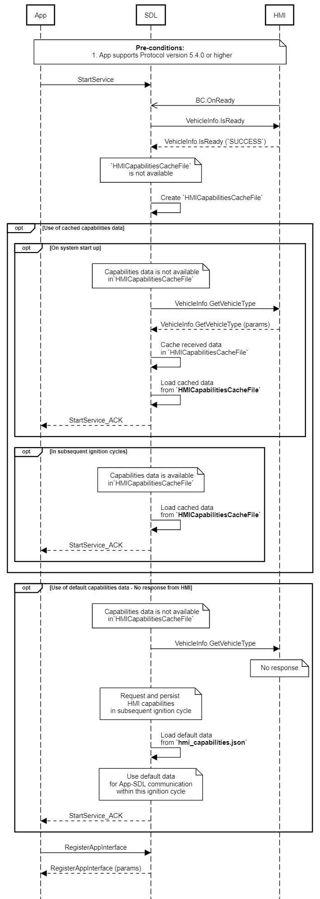

## GetVehicleType

Type
: Function

Sender
: SDL

Purpose
: Get general information about the vehicle.

### Request

#### Parameters

|Name|Type|Mandatory|Additional|
|:---|:---|:--------|:---------|

### Response

#### Parameters

|Name|Type|Mandatory|Additional|
|:---|:---|:--------|:---------|
|vehicleType|[Common.VehicleType](../../common/structs/#vehicletype)|true||

### Sequence Diagrams
|||
GetVehicleType

|||

### Example Request

```json
{
  "id" : 21,
  "jsonrpc" : "2.0",
  "method" : "VehicleInfo.GetVehicleType"
}
```
### Example Response

```json
{
  "id" : 21,
  "jsonrpc" : "2.0",
  "result" :
  {
    "vehicleType" :[
      {
        "make" : "Ford",
        "model" : "Fusion",
        "modelYear" : "2013",
        "trim" : "SE"
      }
    ],
    "code" : 0,
    "method" : "VehicleInfo.GetVehicleType"
  }
}
```

### Example Error

```json
{
  "id" : 21,
  "jsonrpc" : "2.0",
  "error" :
  {
    "code" : 9,
    "message" : "The requested data is not available",
    "data" :
    {
      "method" : "VehicleInfo.GetVehicleType"
    }
  }
}
```
