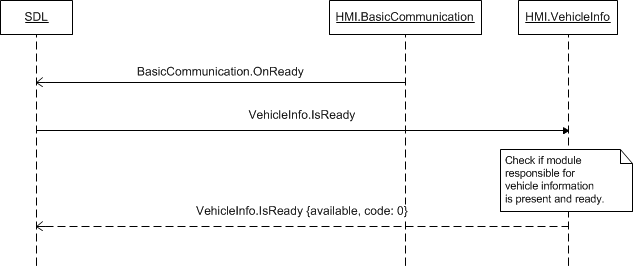

## IsReady

Type
: Function

Sender
: SDL

Purpose
: Request ready state of the VehicleInfo Module

### Request

!!! note

1. SDL sends `VehicleInfo.IsReady` request after HMI confirms its readiness via `BC.OnReady` notification.
2. If HMI responds with `"available":false`, SDL will not further communicate over VehicleInfo interface with HMI.
3. If HMI does not respond during SDL's default timeout, SDL will continue to send RPCs over VehicleInfo interface to HMI.

!!!

#### Parameters

This RPC has no additional parameter requirements

### Response

!!! must

1. Check whether VehicleInfo module is available and ready.
2. Respond correspondingly to results of this check.

!!!

#### Parameters

|Name|Type|Mandatory|Additional|
|:---|:---|:--------|:---------|
|available|Boolean|true||

### Sequence Diagrams
|||
IsReady

|||

### JSON Message Examples

#### Example Request

```json
{
  "id" : 17,
  "jsonrpc" : "2.0",
  "method" : "VehicleInfo.IsReady"
}
```

#### Example Response

```json
{
  "id" : 17,
  "jsonrpc" : "2.0",
  "result" :
  {
    "available" : true,
    "code" : 0,
    "method" : "VehicleInfo.IsReady"
  }
}
```

#### Example Error

```json
{
  "id" : 17,
  "jsonrpc" : "2.0",
  "error" :
  {
    "code" : 9,
    "message" : "Data not available",
    "data" :
    {
      "method" : "VehicleInfo.IsReady"
    }
  }
}
```
