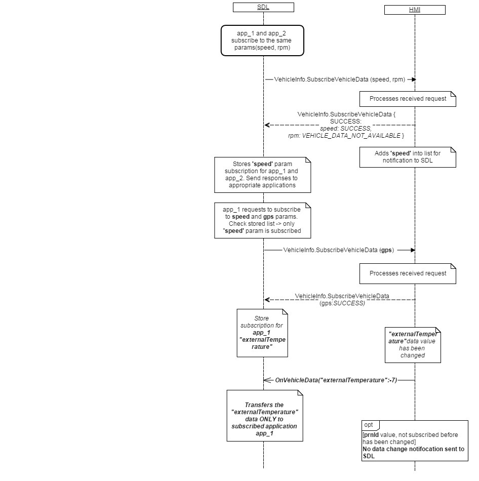

## OnVehicleData

### Notification

#### Parameters

|Name|Type|Mandatory|Additional|Description|
|:---|:---|:--------|:---------|:----------|
|gps|Common.GPSData|false|||
|speed|Float|false|minvalue: 0 maxvalue: 700||
|rpm|Integer|false|minvalue: 0 maxvalue: 20000||
|fuelLevel|Float|false|minvalue: -6 maxvalue: 106||
|fuelLevel_State|Common.ComponentVolumeStatus|false|||
|instantFuelConsumption|Float|false|minvalue: 0 maxvalue: 25575||
|externalTemperature|Float|false|minvalue: -40 maxvalue: 100||
|vin|String|false|maxlength: 17||
|prndl|Common.PRNDL|false|||
|tirePressure|Common.TireStatus|false|||
|odometer|Integer|false|minvalue: 0 maxvalue: 17000000||
|beltStatus|Common.BeltStatus|false|||
|bodyInformation|Common.BodyInformation|false|||
|deviceStatus|Common.DeviceStatus|false|||
|driverBraking|Common.VehicleDataEventStatus|false|||
|wiperStatus|Common.WiperStatus|false|||
|headLampStatus|Common.HeadLampStatus|false|||
|engineTorque|Float|false|minvalue: -1000 maxvalue: 2000||
|accPedalPosition|Float|false|minvalue: 0 maxvalue: 100||
|steeringWheelAngle|Float|false|minvalue: -2000 maxvalue: 2000||
|eCallInfo|Common.ECallInfo|false|||
|airbagStatus|Common.AirbagStatus|false|||
|emergencyEvent|Common.EmergencyEvent|false|||
|clusterModeStatus|Common.ClusterModeStatus|false|||
|myKey|Common.MyKey|false|||

#### GPSData

|Name|Type|Mandatory|Additional|Description|
|:---|:---|:--------|:---------|:----------|
|longitudeDegrees|Float|false|minvalue: -180 maxvalue: 180||
|latitudeDegrees|Float|false|minvalue: -90 maxvalue: 90||
|utcYear|Integer|false|minvalue: 2010 maxvalue: 2100||
|utcMonth|Integer|false|minvalue: 1 maxvalue: 12||
|utcDay|Integer|false|minvalue: 1 maxvalue: 31||
|utcHours|Integer|false|minvalue: 0 maxvalue: 23||
|utcMinutes|Integer|false|minvalue: 0 maxvalue: 59||
|utcSeconds|Integer|false|minvalue: 0 maxvalue: 59||
|compassDirection|Common.CompassDirection|false|||
|pdop|Float|false|minvalue: 0 maxvalue: 10||
|hdop|Float|false|minvalue: 0 maxvalue: 10||
|vdop|Float|false|minvalue: 0 maxvalue: 10||
|actual|Boolean|false|||
|satellites|Integer|false|minvalue: 0 maxvalue: 31||
|dimension|Common.Dimension|false|||
|altitude|Float|false|minvalue: -10000 maxvalue: 10000||
|heading|Float|false|minvalue: 0 maxvalue: 359.99||
|speed|Float|false|minvalue: 0 maxvalue: 500||

#### ComponentVolumeStatus

|Name|Value|
|:---|:----|
|UNKNOWN|0|
|NORMAL|1|
|LOW|2|
|FAULT|3|
|ALERT|4|
|NOT_SUPPORTED|5|

#### PRNDL

|Name|Value|
|:---|:----|
|PARK|0|
|REVERSE|1|
|NEUTRAL|2|
|DRIVE|3|
|SPORT|4|
|LOWGEAR|5|
|FIRST|6|
|SECOND|7|
|THIRD|8|
|FOURTH|9|
|FIFTH|10|
|SIXTH|11|
|SEVENTH|12|
|EIGHTH|13|
|FAULT|14|

#### TireStatus

|Name|Type|Mandatory|Additional|Description|
|:---|:---|:--------|:---------|:----------|
|pressureTelltale|Common.WarningLightStatus|false|||
|leftFront|Common.SingleTireStatus|false|||
|rightFront|Common.SingleTireStatus|false|||
|leftRear|Common.SingleTireStatus|false|||
|rightRear|Common.SingleTireStatus|false|||
|innerLeftRear|Common.SingleTireStatus|false|||
|innerRightRear|Common.SingleTireStatus|false|||

#### BeltStatus

|Name|Type|Mandatory|Additional|Description|
|:---|:---|:--------|:---------|:----------|
|driverBeltDeployed|Common.VehicleDataEventStatus|false|||
|passengerBeltDeployed|Common.VehicleDataEventStatus|false|||
|passengerBuckleBelted|Common.VehicleDataEventStatus|false|||
|driverBuckleBelted|Common.VehicleDataEventStatus|false|||
|leftRow2BuckleBelted|Common.VehicleDataEventStatus|false|||
|passengerChildDetected|Common.VehicleDataEventStatus|false|||
|rightRow2BuckleBelted|Common.VehicleDataEventStatus|false|||
|middleRow2BuckleBelted|Common.VehicleDataEventStatus|false|||
|middleRow3BuckleBelted|Common.VehicleDataEventStatus|false|||
|leftRow3BuckleBelted|Common.VehicleDataEventStatus|false|||
|rightRow3BuckleBelted|Common.VehicleDataEventStatus|false|||
|leftRearInflatableBelted|Common.VehicleDataEventStatus|false|||
|rightRearInflatableBelted|Common.VehicleDataEventStatus|false|||
|middleRow1BeltDeployed|Common.VehicleDataEventStatus|false|||
|middleRow1BuckleBelted|Common.VehicleDataEventStatus|false|||

#### BodyInformation

|Name|Type|Mandatory|Additional|Description|
|:---|:---|:--------|:---------|:----------|
|parkBrakeActive|Boolean|true|||
|ignitionStableStatus|Common.IgnitionStableStatus|true|||
|ignitionStatus|Common.IgnitionStatus|true|||
|driverDoorAjar|Boolean|false|||
|passengerDoorAjar|Boolean|false|||
|rearLeftDoorAjar|Boolean|false|||
|rearRightDoorAjar|Boolean|false|||

#### DeviceStatus

|Name|Type|Mandatory|Additional|Description|
|:---|:---|:--------|:---------|:----------|
|voiceRecOn|Boolean|false|||
|btIconOn|Boolean|false|||
|callActive|Boolean|false|||
|phoneRoaming|Boolean|false|||
|textMsgAvailable|Boolean|false|||
|battLevelStatus|Common.DeviceLevelStatus|false|||
|stereoAudioOutputMuted|Boolean|false|||
|monoAudioOutputMuted|Boolean|false|||
|signalLevelStatus|Common.DeviceLevelStatus|false|||
|primaryAudioSource|Common.PrimaryAudioSource|false|||
|eCallEventActive|Boolean|false|||

#### VehicleDataEventStatus

|Name|Value|
|:---|:----|
|NO_EVENT|0|
|NO|1|
|YES|2|
|NOT_SUPPORTED|3|
|FAULT|4|

#### WiperStatus

|Name|Value|
|:---|:----|
|OFF|0|
|AUTO_OFF|1|
|OFF_MOVING|2|
|MAN_INT_OFF|3|
|MAN_INT_ON|4|
|MAN_LOW|5|
|MAN_HIGH|6|
|MAN_FLICK|7|
|WASH|8|
|AUTO_LOW|9|
|AUTO_HIGH|10|
|COURTESYWIPE|11|
|AUTO_ADJUST|12|
|STALLED|13|
|NO_DATA_EXISTS|14|

#### HeadLampStatus

|Name|Type|Mandatory|Additional|Description|
|:---|:---|:--------|:---------|:----------|
|lowBeamsOn|Boolean|true|||
|highBeamsOn|Boolean|true|||
|ambientLightSensorStatus|Common.AmbientLightStatus|true|||

#### ECallInfo

|Name|Type|Mandatory|Additional|Description|
|:---|:---|:--------|:---------|:----------|
|eCallNotificationStatus|Common.VehicleDataNotificationStatus||||
|auxECallNotificationStatus|Common.VehicleDataNotificationStatus||||
|eCallConfirmationStatus|Common.ECallConfirmationStatus||||

#### AirbagStatus

|Name|Type|Mandatory|Additional|Description|
|:---|:---|:--------|:---------|:----------|
|driverAirbagDeployed|Common.VehicleDataEventStatus||||
|driverSideAirbagDeployed|Common.VehicleDataEventStatus||||
|driverCurtainAirbagDeployed|Common.VehicleDataEventStatus||||
|passengerAirbagDeployed|Common.VehicleDataEventStatus||||
|passengerCurtainAirbagDeployed|Common.VehicleDataEventStatus||||
|driverKneeAirbagDeployed|Common.VehicleDataEventStatus||||
|passengerSideAirbagDeployed|Common.VehicleDataEventStatus||||
|passengerKneeAirbagDeployed|Common.VehicleDataEventStatus||||

#### EmergencyEvent

|Name|Type|Mandatory|Additional|Description|
|:---|:---|:--------|:---------|:----------|
|emergencyEventType|Common.EmergencyEventType||||
|fuelCutoffStatus|Common.FuelCutoffStatus||||
|rolloverEvent|Common.VehicleDataEventStatus||||
|maximumChangeVelocity|Common.VehicleDataEventStatus||||
|multipleEvents|Common.VehicleDataEventStatus||||

#### ClusterModeStatus

|Name|Type|Mandatory|Additional|Description|
|:---|:---|:--------|:---------|:----------|
|powerModeActive|Boolean||||
|powerModeQualificationStatus|Common.PowerModeQualificationStatus||||
|carModeStatus|Common.CarModeStatus||||
|powerModeStatus|Common.PowerModeStatus||||

#### MyKey

|Name|Type|Mandatory|Additional|Description|
|:---|:---|:--------|:---------|:----------|
|e911Override|Common.VehicleDataStatus|true|||

### Sequence Diagrams
|||
OnVehicleData

|||
