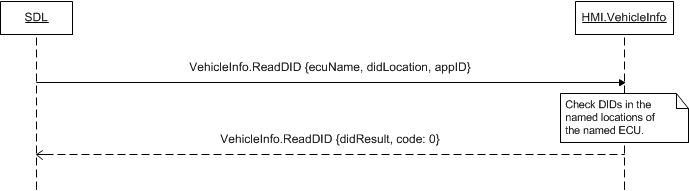
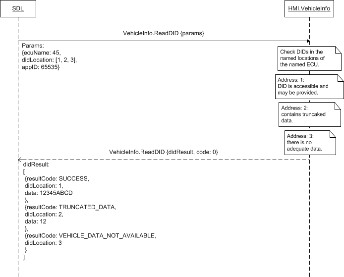

## ReadDID

Type
: Function

Sender
: SDL

Purpose
: Request data from specified DID locations.

### Request

#### Parameters

|Name|Type|Mandatory|Additional|
|:---|:---|:--------|:---------|
|ecuName|Integer|true|minvalue: 0<br>maxvalue: 65535|
|didLocation|Integer|true|array: true<br>minsize: 1<br>maxsize: 1000<br>minvalue: 0<br>maxvalue: 65535|
|appID|Integer|true||

### Response

#### Parameters

|Name|Type|Mandatory|Additional|
|:---|:---|:--------|:---------|
|didResult|[Common.DIDResult](../../Common/Structs/index.md#didresult)|false|array: true<br>minsize: 0<br>maxsize: 1000|

### Sequence Diagrams
|||
ReadDID General Processing

|||
|||
ReadDID Expanded result

|||

### Example Request

```json
{
	"id" : 158,
	"jsonrpc" : "2.0",
	"method" : "VehicleInfo.ReadDID",
	"params" :
	{
		"ecuName" : 1287,
		"didLocation" : [35, 48, 182],
		"appID" : 93
	}
}
```
### Example Response

```json
{
	"id" : 158,
	"jsonrpc" : "2.0",
	"result" :
	{
		"didResult" :
		[
			{
			"resultCode" : SUCCESS,
			"didLocation" : 35,
			"data" : "38AF"
			},
			{
			"resultCode" : TRUNCATED_DATA,
			"didLocation" : 48,
			"data" : "35"
			},
			{
			"resultCode" : INVALID_ID,
			"didLocation" : 182
			}			
		],
		"code" : 0,
		"method" : "VehicleInfo.ReadDID"
	}
}
```

### Example Error

```json
{
	"id" : 158,
	"jsonrpc" : "2.0",
	"error" :
	{
		"code" : 2,
		"message" : "The requested ECU does not exist",
		"data" :
		{
			"method" : "VehicleInfo.ReadDID"
		}
	}
}
```
