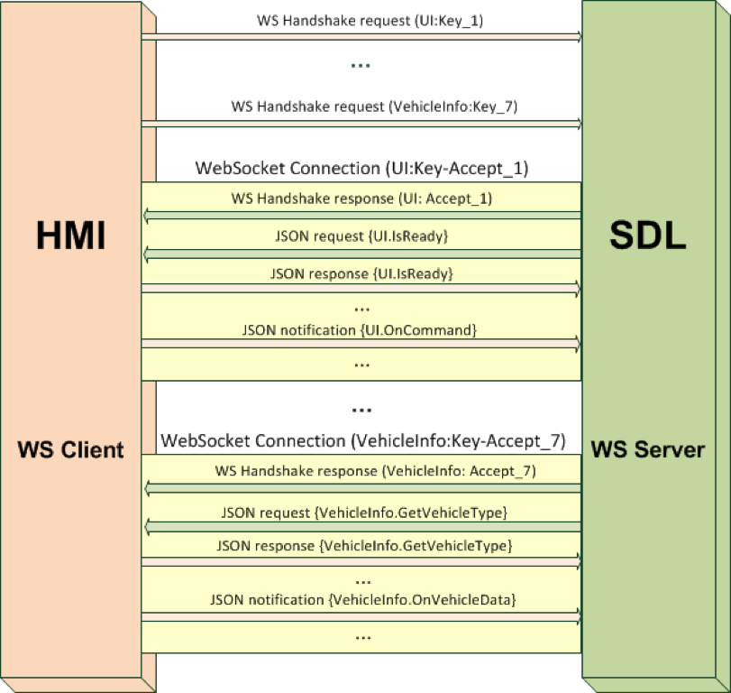
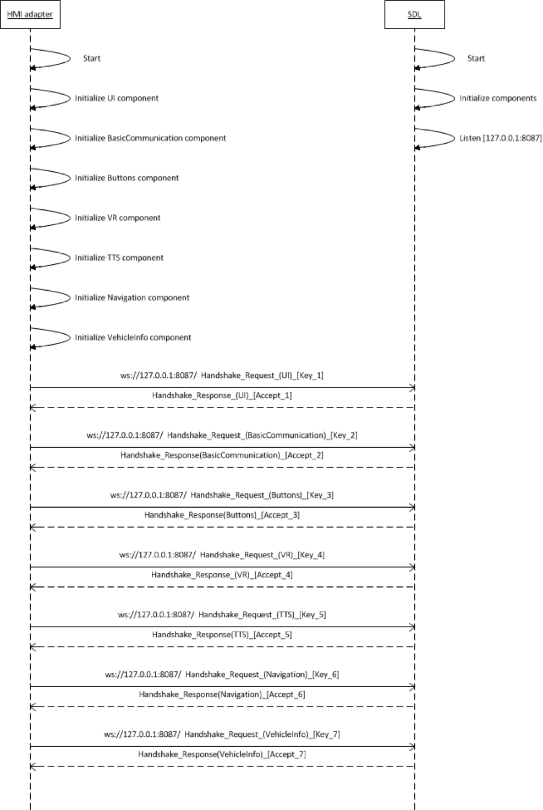

# 连接到 SDL

## HMI 适配器的要求

WebSocket 是从车辆与 SDL 组件进行通信的主要方法。在基本示例中，HTML5 HMI 使用本机 WebSocket 库与 SDL 核心进行通信。

HMI 适配器必须：

!!! must
  * 安装在安装 SDL 的车辆 HU OS 上，或者 HMI 必须能够联网到 SDL 并通过静态 IP 地址对其寻址。
  * 针对在车辆 HU 上运行的 SDL 版本，创建并初始化 HMI_API 规范中定义的组件。（BasicCommunication、UI、按钮、VR、TTS、导航、VehicleInfo）
  * 对于 HMI_API 规范中定义的每个组件，建立与 SDL 的单独 WebSocket 连接。
  * 当向任何连接的组件发送响应和通知时，使用正确的对应连接。

!!!

## 握手协议
为了打开 WebSocket 连接，必须执行握手。

!!! info
  1. 客户端/服务器关系
    * SDL 是服务器
    * HMI 是客户端
  2. 主机
    * SDL 在 127.0.0.1:8087 上侦听
  3. SDL 使用 WebSocket 协议版本(Version)13
  
!!!

## HMI 组件注册
一旦打开所有请求的连接，HMI 必须发送 JSON 请求才能注册每个组件任务：（请参阅第 4.2 节了解 JSON 格式详细信息，参阅第 4 个示例了解注册示例）。

组件注册具有以下独特请求要求

| 键     | 值信息    |
| :------------- | :------------- |
| "id"       | 100 的倍数(100, 200, 300, ..., 700) |
| "jsonrpc" | “2.0”- 是一个常量适用于 SDL 和 HMI 之间的所有消息|
| "method" | “MB.registerComponent”- 分配给 SDL 的 MessageBroker 的请求，其中组件名称将与套接字 ID 相关联。接下来，SDL 将通过相应的连接发送与命名组件相关的消息。|
|"componentName"| 正在注册的组件的名称。必须对应于当前指南中描述的相应组件名称|

SDL 提供 JSON 响应

| 键 | 值信息   |
| :------------- | :------------- |
| "id"      | 来自相应请求的值      |
| "result" | ID 值乘以 10。HMI 可将其视为成功注册|

### 组件注册示例

#### 注册组件 JSON 消息
##### 请求
``` json
{
  "id": 700,
  "jsonrpc": "2.0",
  "method": "MB.registerComponent",
  "params": {
    "componentName": "VehicleInfo"
  }
}
```
##### 响应
``` json
{
  "id": 700,
  "jsonrpc": "2.0",
  "result": 7000
}
```

#### WebSocket 连接图


#### HMI 适配器初始化


# JSON 消息格式
本节描述在 HMI 和 SDL 之间通信的消息结构。JSON RPC 2.0 格式作为基础。

从该基础开始，将考虑交换消息的操作者：

  * 客户端 - 可以发送请求和通知
  * 服务器 - 可以提供对客户端请求的响应，并发送通知
  
## 请求
通过将 Request 对象发送到服务器来提供 RPC 调用。Request 对象具有以下属性

| 属性 | 描述    |
| :------------- | :------------- |
| "id"       | 标识符是通过客户端建立的。在 HMI 与 SDL 之间的通信帧中，该值必须为无符号整数类型。该值永远不应为 Null。如果不包括“id”，则假设消息为通知，接收方不应当响应。|
| "jsonrpc" | 用于指定正在使用的 JSON RPC 协议版本的字符串。在 SDL 的所有版本中，当前必须确切为“2.0”。|
| "method" | 包含要调用的方法信息的字符串。格式为“[componentName].[methodName]”。|
| "params" | 用于保存要在方法调用期间使用的参数值的结构化值。可以忽略该属性。|

### 请求示例
#### 不包含参数的请求
```json
{
  "id": 125,
  "jsonrpc": "2.0",
  "method": "Buttons.GetCapabilities"
}
```
#### 包含参数的请求
```json
{
  "id": 92,
  "jsonrpc": "2.0",
  "method": "UI.Alert",
  "params": {
    "alertStrings": [
      {
        "fieldName": "alertText1",
        "fieldText": "WARNING"
      },
      {
        "fieldName": "alertText2",
        "fieldText": "Adverse Weather Conditions Ahead"
      }
    ],
    "duration": 4000,
    "softButtons": [
      {
        "type": "TEXT",
        "text": "OK",
        "softButtonID": 697,
        "systemAction": "STEAL_FOCUS"
      }
    ],
    "appID": 8218
  }
}
```

## 通知
通知是不含`id`属性的 Request 对象。对于所有其他属性，请参见 [请求章节](#request)

接收方不应当回复通知，即在收到通知后不需要向客户端返回任何 Response 对象。

### 通知示例
#### 不包含参数的通知
```json
{
  "jsonrpc": "2.0",
  "method": "UI.OnReady"
}
```
#### 包含参数的通知
```json
{
  "jsonrpc": "2.0",
  "method": "BasicCommunication.OnAppActivated",
  "params": {
    "appID": 6578
  }
}

{
  "jsonrpc": "2.0",
  "method": "Buttons.OnButtonPress",
  "params": {
    "mode": "SHORT",
    "name": "OK"
  }
}
```

## 响应
收到请求消息后，服务器必须通过响应回复。响应表示为具有以下属性的单一 JSON 对象。

| 属性 | 描述    |
| :------------- | :------------- |
| "id"      | 必须与关联 Request 对象的值相同的必需属性。如果在检测 Request 对象中的 ID 时发现错误，则该值必须为 Null    |
|"jsonrpc"| 必须确切为“2.0”|
|"result"| 成功时需要。如果调用方法时出现错误，则不得存在。结果属性必须包含与对应请求相同的“方法”字段和包含 0 以表示成功的“代码”字段。不能在 Response 对象中发送其他结果代码。结果属性还可以包括 HMI_API 中定义的附加属性。|

### 响应示例
#### 不包含参数的响应
```json
{
  "id": 167,
  "jsonrpc": "2.0",
  "result": {
    "code": 0,
    "method": "UI.Alert"
  }
}
```
#### 包含参数的响应
```json
{
  "id": 125,
  "jsonrpc": "2.0",
  "result": {
    "capabilities" : [
      {
        "longPressAvailable" : true,
        "name" : "PRESET_0",
        "shortPressAvailable" : true,
        "upDownAvailable" : true
      },
      {
        "longPressAvailable" : true,
        "name" : "TUNEDOWN",
        "shortPressAvailable" : true,
        "upDownAvailable" : true
      }
    ],
    "presetBankCapabilities": {
      "onScreenPresetsAvailable" : true
    },
    "code" : 0,
    "method" : "Buttons.GetCapabilities"
  }
}
```

## 错误响应

!!! must

当 RPC 遇到错误时，Response 对象必须包含“error”属性，而不是“result”属性。

!!!

Error 对象具有以下成员：

| 属性 | 描述     |
| :------------- | :------------- |
| "id"       | 要求与相应 Request 对象的 ID 值相同的必需属性。如果在检测 Request 对象的 ID 时发现错误，则该属性必须为 Null   |
| "jsonrpc"| 必须确切为“2.0”|
| "error" | 出错时需要。如果调用期间未触发错误，则不得存在。错误字段必须包含其值指示发生的错误类型的“代码”字段（第 5.1.1 节的任务：结果枚举）、含有提供错误的简短描述的字符串的“消息”字段，以及必须含有原始请求“方法”的“数据”字段。|

### 示例
#### 包含错误的响应
```json
{
  "id": 103,
  "jsonrpc": "2.0",
  "error": {
    "code": 13,
    "message": "One of the provided IDs is not valid",
    "data": {
      "method": "VehicleInfo.GetDTCs"
    }
  }
}
```
